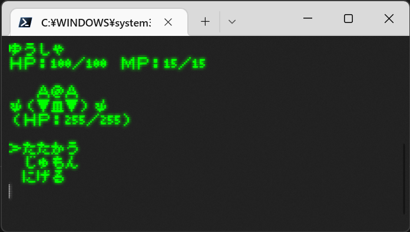

# cli-games-typescript

[小一時間でゲームをつくる──7つの定番ゲームのプログラミングを体験](https://gihyo.jp/book/2022/978-4-297-12745-9)

この本を全部TypeScriptで作ってみたいやつ。C++でCLIのゲームを7つ作る本。

最初はサンプルコードのC++になるべく忠実に作って、ある程度できたらTypeScriptに最適化して作り直したい。

[美咲ゴシック](https://littlelimit.net/misaki.htm)推奨。

# インストール

```sh
git clone git@github.com:zakuroishikuro/cli-games-typescript.git
cd cli-games-typescript
npm i
```

# RPG



```sh
npm run rpg
```

コマンド選択はw・sで上下。それ以外のキーは決定。呪文はヒールのみ。


# ライフゲーム

```sh
npm run lifegame
```

これ → https://www.youtube.com/watch?v=yw-j-4xYAN4